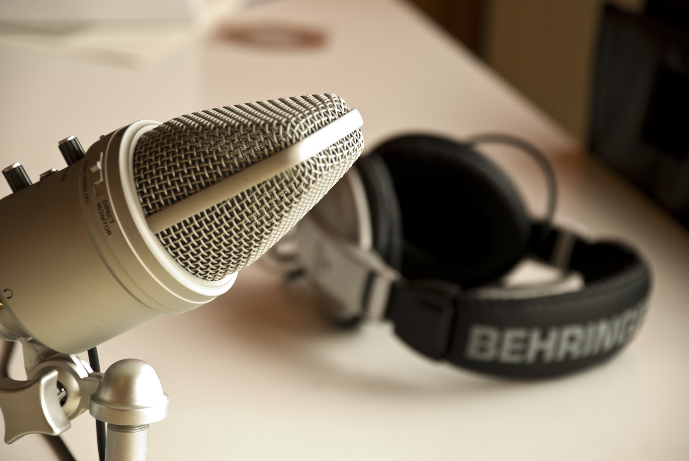

# Find Your New Favorite Podcast!

This project aims to provide recommendations for new podcasts based on the podcasts you already know and love. Using methods such as natural language processing, cosine similarities, and Flask, this interactive tool will be useful for anyone wishing to expand their current podcast library.

This project is currently in progress, so stay tuned for more updates!

##### Note:
Data source: https://github.com/ageitgey/all-podcasts-dataset
